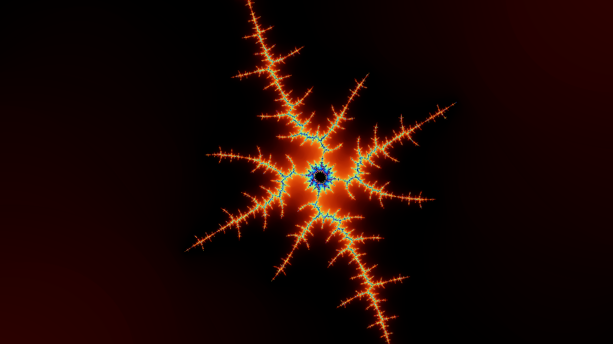
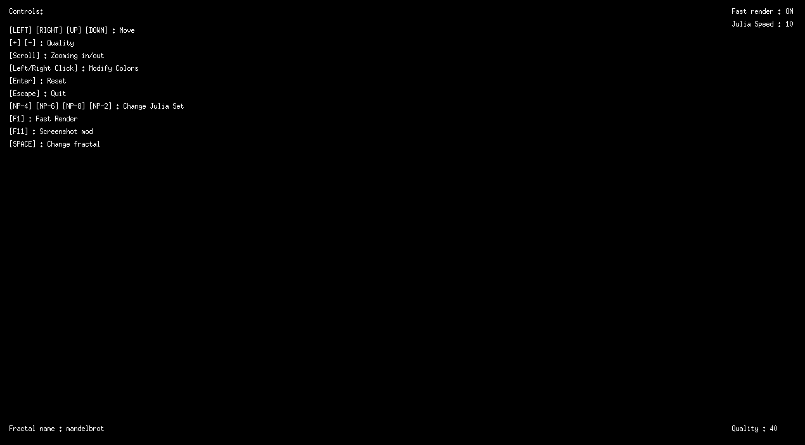
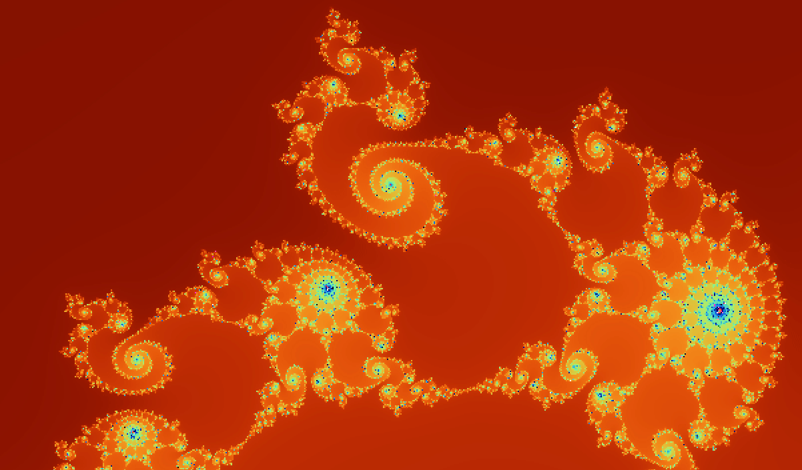
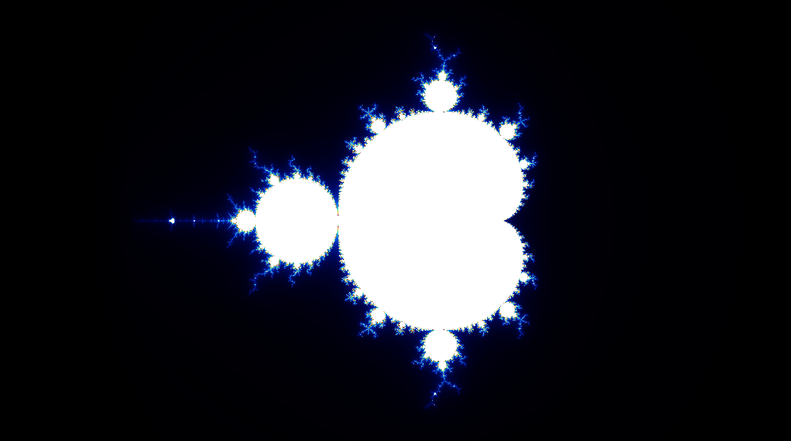
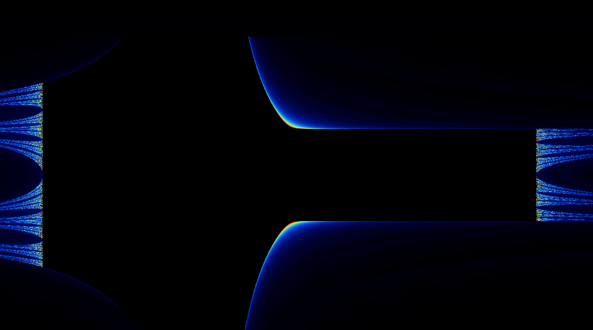
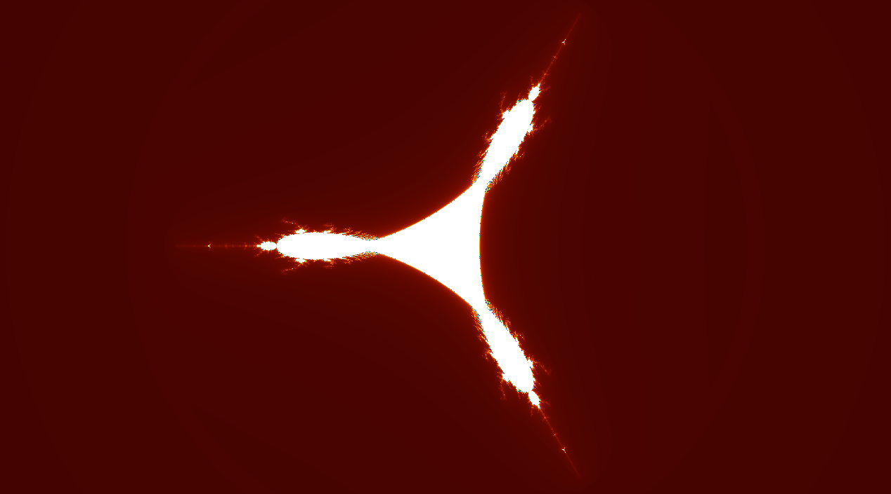
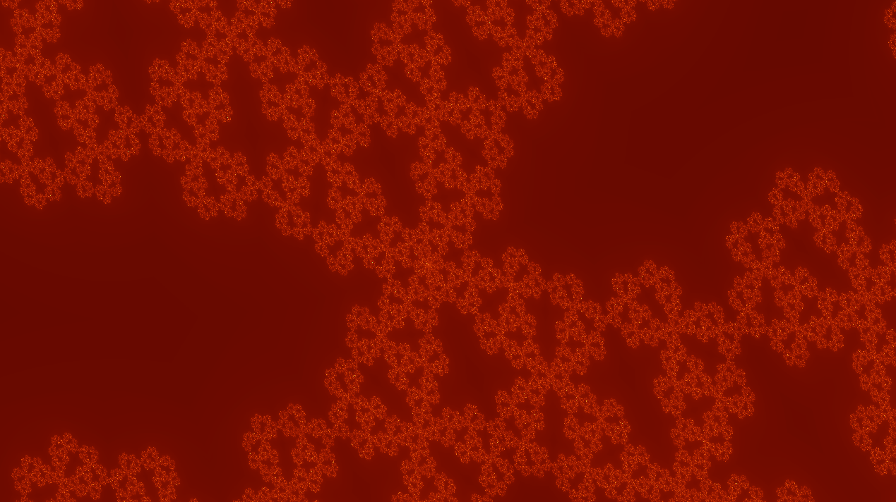

# Fractol

## Language : C
Ce projet à été réalisé dans le cadre du cursus à l'école **42 Paris**.

Fractol est un programme permettant d'afficher et d'éxplorer différentes fractales intéractives à l'aide de la bibliothèqe graphique MinilibX. Il met en oeuvre des calculs mathématiques afin de tracer en temps réel des ensembles fractals.

---

## Instalation et Compilation

### Prérequis
- Une machine sous **Linux** ou **MacOS**
- La bibliothèque **MinilibX** installée
- Un compilateur **cc**

### MinilibX
Avant de compiler le projet, il est nécessaire d'installer la **[MinilibX](https://github.com/42paris/minilibx-linux.git)**.

Il faut :

Cloner la MinilibX dans le dossier du proejt puis y rentrer :

```sh
git clone https://github.com/42paris/minilibx-linux.git minilibx && cd minilibx
``` 

Compiler la MinilibX puis sortir :

```sh
make && cd ..
```

### Compilation
La commande suivante génère un exécutable 'fractol':

```sh
make
```

Pour nettoyer les fichiers objets :

```sh
make clean
```

Pour supprimer les fichiers objets et l'exécutable :

```sh
make fclean
```

Pour recompiler depuis zéro :

```sh
make re
```

### Bonus
La commande suivant génère un exécutable 'fractol_bonus', plus complet que l'exécutable précèdent :

```sh
make bonus
```

Pour recompiler le bonus depuis zéro :

```sh
make re_bonus
```

---

## Utilisation
Le programme prends en argument le type de fractale à afficher :

```sh
./fractol [type]
```

Avec '[type]' pouvant être :

- 'mandelbrot'
- 'julia' <x> <y>
- 'lambda' **(bonus)**
- 'burning_ship' **(bonus)**
- 'tricorn' **(bonus)**

Exemple :

```sh
./fractol julia -1.47 0.0
```

---

## Contrôles
Dans cette première partie **il n'est pas possible de se déplacer, de changer de couleurs ou de zoomer sur le curseur**.

L'interface utilisateur est disponible et affiche les contrôles ainsi que des informations.



Il est possible de changer le mode d'affichage via la touche 'F1' :



---

## Fonctionnement de l'algorithme
L'algorithme repose sur plusieurs étapes :

1. **Initialisation des données**

  - Définition des paramètres d'affichage et des constantes fractales en fonction de l'entrée.

2. **Calcul des ensempbles fractals**

  - Chaque pixel est évalué en fonction de son appartenance à l'ensemble fractal choisi en utilisant l'équation liée.
  - Utilisation d'une **Interpolation par plus proche voisin** permettant un calcul plus rapide au détriment de la qualité.
  - Possibilité de **modifier le nombre d'itérations avant divergence** pour ajuster la précision de l'affichage.

3. **Rendu graphique**

  - Transformation des valeurs calculées en couleurs et gradient.
  - Affichage via la MinilibX.

4. **Gestion des interactions Utilisateur**

  - Réactivité aux entrées clavier et souris.

---

## Les Fractales
Voici les fractales disponibles dans le programme :

### Ensemble de Mandelbrot
L'ensemble de Mandelbrot est définit par l'itération de la fonction complexe suivante :
$z_{n+1}=z_n^2+c$

Avec :
- $z_0=0$
- c un nombre complexe correspondant aux coordonnées du pixel.

Un point appartient à l'ensemble si $|z_n|$ reste borné après un certain nombre d'itérations.



### Ensemble de Julia
L'ensemble de Julia est similaire à celui de Mandelbrot :

$z_{n+1}=z_n^2+c$

Avec :
- $z_0$ les coordonnées complexes du pixel.
- c est un paramètre complexe fixe.


### Lambda
L'ensemble de **Lambda** est défini par une transformation logarithmique de la forme :

$z_{n+1}=\lambda z_n(1 - z_n)$

Avec :
- $\lambda$ un paramètre détermianant la dynamique du système.
- $z_0$ le point complexe initial.



### Tricorn
Le fractal **Tricorn** est une variation de Mandelbrot où on applique la valeur absolue aux parties réelles et imaginaires :

$z_{n+1}=(|Re(z_n)| + i|Im(z_n)|)^2+c$



### Burning Ship
**Burning Ship** est une autre variation de Mandelbrot qui utilise le conjugaison complexe :

$z_{n+1}=\overline{z_n}^2+c$




